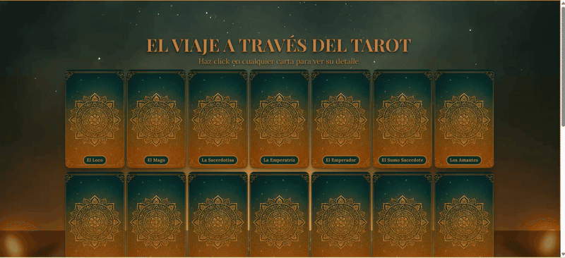
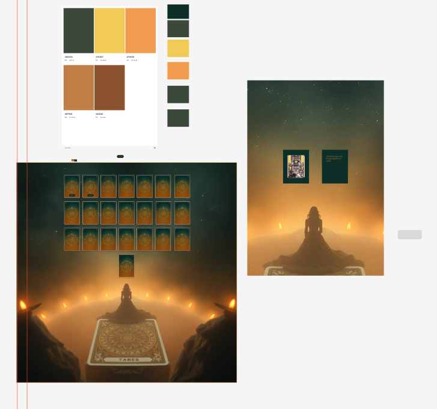
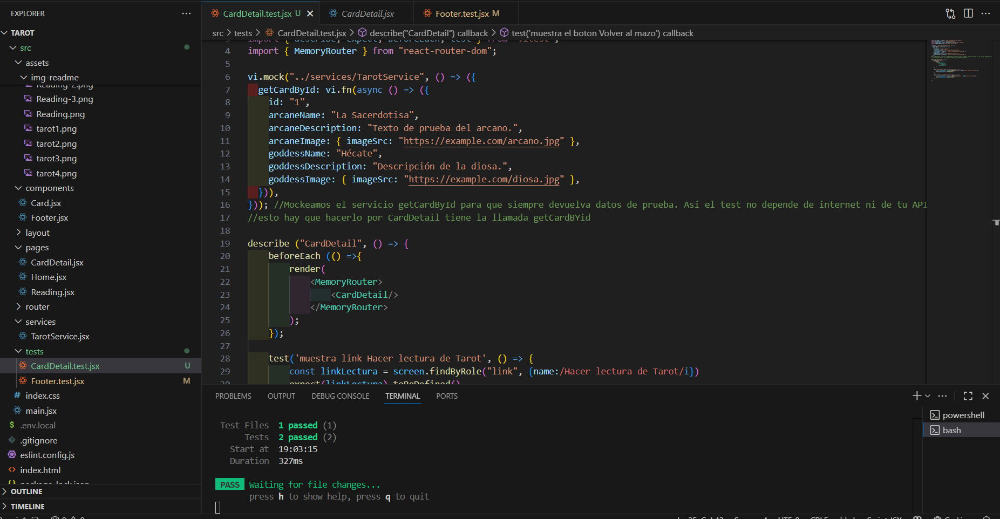

# 🔮 El Viaje a través del Tarot

Aplicación web en React para explorar los **Arcanos Mayores** del Tarot: listado de cartas, **detalle** de cada arcano y **lectura de 3 cartas** (Pasado · Presente · Futuro).  
Proyecto desplegado en producción con **Vercel** y consumo de una **API pública**.

**Demo:** https://elviajedeltarot.vercel.app/

---

## ✨ Descripción

Una experiencia web sencilla y elegante para:
- Navegar por el mazo de Arcanos Mayores.
- Abrir el **detalle** de cada carta (imagen + descripción).
- Realizar una **lectura guiada** de 3 cartas (Pasado, Presente y Futuro).

La app está pensada para ser **responsive**, accesible con teclado y rápida (Vite + Tailwind, imágenes lazy, y fondo optimizado).




---

## ⚡ Características

- 🃏 **Grid de cartas** responsive con hover y estados (loading / error).
- 🔍 **Detalle** de carta con imagen y contenido.
- 🧭 **Lectura guiada** de 3 cartas (paso a paso, con indicador de progreso).
- 🌗 **Fondo global** con efecto fijo en *Home* y comportamiento personalizado en otras páginas.
- 🌐 **API pública** (MockAPI) consumida via **Axios**.
- 🧩 **Arquitectura** por páginas y componentes reutilizables.
- 🚀 **Despliegue continuo** con Vercel (cada push publica automáticamente).

---

## 🎨 Diseño

El diseño está basado en un prototipo de **Figma** (tipografías, composición y paleta coherentes con el tema del tarot).




### 🎨 Paleta de colores (proyecto)

- **Verde muy oscuro** `#0E2F28`  
- **Verde medio** `#3B493A`  
- **Marrón oscuro** `#A46C28`  
- **Naranja oscuro** `#BF7E45`  
- **Naranja claro** `#F29C50`  
- **Amarillo** `#F2CB57`

### ✍️ Tipografías

- **Playfair Display** (títulos)  
- **Lora** (cuerpo de texto)

---

## 🛠️ Tech Stack

- **React + Vite**
- **React Router DOM**
- **Tailwind CSS**
- **Axios**
- **Node.js & npm**
- **Vercel** (deploy)
- **API pública (MockAPI)** para cartas del Tarot

---

## 🌍 Variables de entorno

Crea un archivo `.env` en la raíz del proyecto con:
VITE_API_URL=https://tu-api-url

---

## 📦 Dependencias principales

- `react-router-dom` → enrutado de páginas  
- `axios` → consumo de API  
- `tailwindcss` → estilos rápidos y responsive  

---

## 🧪 Testing

- Configuración inicial con **Vitest** + **React Testing Library**.  
- Tests básicos de renderizado (`CardDetail`, `Footer`).  

---


## ⚙️ Instalación (local)

### 📋 Prerrequisitos
- Node.js **18+**
- npm

### 🔧 Setup

```bash
git clone https://github.com/gemayc/tarot.git
cd tarot
npm install
```
---

### 🗂️ Estructura de archivos
```bash

/public
  ├── fondo2.(png)      # imagen de fondo global
  └── favicon / assets estáticos

/src
  ├── assets/                # imágenes del proyecto
  ├── components/
  │   └── Card.jsx           # carta reutilizable
  ├── layout/
  │   └── Footer.jsx
  ├── pages/
  │   ├── Home.jsx           # grid de cartas
  │   ├── Reading.jsx        # lectura Pasado/Presente/Futuro
  │   └── CardDetail.jsx     # detalle de carta
  ├── router/
  ├── services/
  │   └── TarotService.jsx   # axios + consumo de API (usa VITE_API_URL)
  ├── index.css              # estilos globales + tailwind
  └── main.jsx               # entrada de la app

  ---
  ```

### 👩‍💻 Desarrolladora

[Gema Yébenes Caballero](https://www.linkedin.com/in/gema-y%C3%A9benes-caballero-83b6a6100/)  
[](https://www.linkedin.com/in/gema-y%C3%A9benes-caballero-83b6a6100/)

### 📄 Licencia

MIT — Uso educativo y demostrativo.

